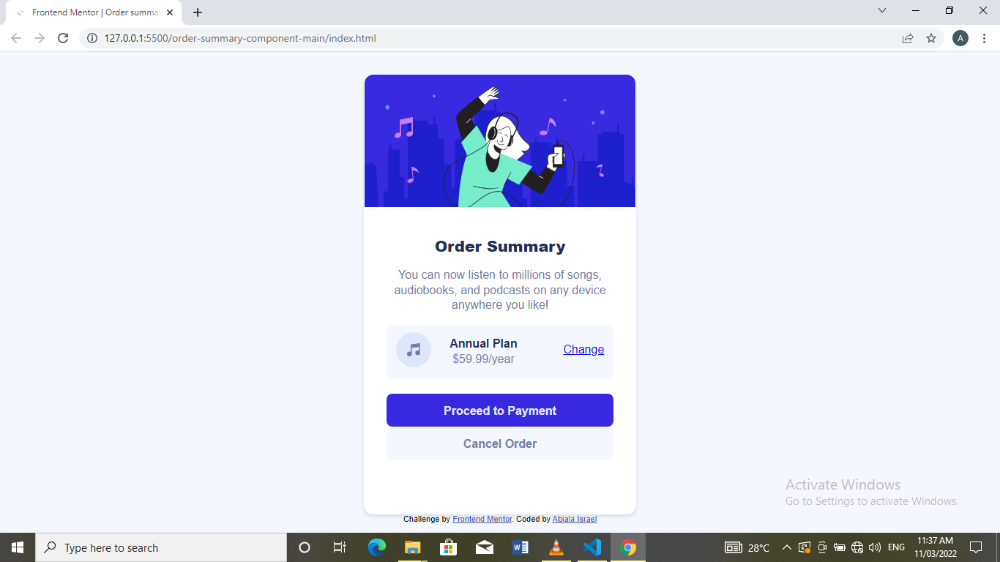

# Frontend Mentor - Order summary card solution

This is a solution to the [Order summary card challenge on Frontend Mentor](https://www.frontendmentor.io/challenges/order-summary-component-QlPmajDUj). Frontend Mentor challenges help you improve your coding skills by building realistic projects.

## Table of contents

- [Overview](#overview)
  - [The challenge](#the-challenge)
  - [Screenshot](#screenshot)
  - [Links](#links)
- [My process](#my-process)
  - [Built with](#built-with)
  - [What I learned](#what-i-learned)
  - [Continued development](#continued-development)
  - [Useful resources](#useful-resources)
- [Author](#author)
- [Acknowledgments](#acknowledgments)

## Overview

### The challenge

Users should be able to:

- See hover states for interactive elements

### Screenshot

### Links

- Solution URL: [Add solution URL here](https://your-solution-url.com)
- Live Site URL: [Order-Netlify](https://abialaisrael-order-component-card.netlify.app/)

## My process

### Built with

- Semantic HTML5 markup
- CSS custom properties
- Flexbox

### What I learned

I was able to practice using the CSS flexbox in this project. It was quite fascinating. For a component like this, designing it makes me to be familiar with various concepts and properties in Flexbox. Any website I open now, I try to visualize it with flexbox😎😎.

### Continued development

I will like to learn more about media queries because I received a feedback on the previous project that it doesn't fit well on desktop.

## Author

- Frontend Mentor - [@Abiala705](https://www.frontendmentor.io/profile/Abiala705)
- Twitter - [@abiala_israel](https://www.twitter.com/abiala_israel)
- LinkedIn - [@Abiala (Adetayo) Israel](https://www.linkedin.com/in/abiala-israel)
